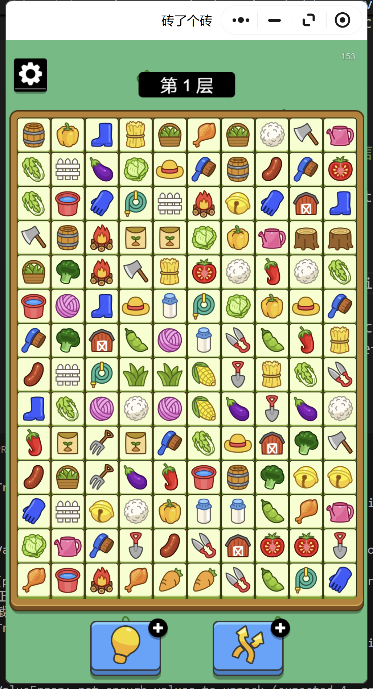

# ZhuanSolver

## 项目概述

本项目是一个基于图像识别和路径搜索算法的自动化解谜游戏助手，主要针对名为“砖了个砖”的游戏。通过图像识别技术从屏幕截图中提取游戏状态，并使用贪心最佳优先搜索（GBFS）来寻找解决方案。

## 文件结构

- `main_entry.py`: 主入口文件，包含初始化、图像识别、状态生成和路径搜索的核心逻辑。
- `app/zhuan/`: 包含与游戏相关的模块，如板面状态管理、节点定义、识别器和反应器等。
- `controller/`: 控制器模块，负责游戏窗口的控制和迭代主循环。
- `datasets/`: 训练数据集，用于训练 YOLO 模型。
- `state/`: 搜索算法模块，实现不同的搜索策略。

## 运行方法

1. 使用 `pip install -r requirements.txt` 安装如下必要的依赖：

- `ultralytics`: 用于训练 YOLO 模型
- `pyautogui`: 用于屏幕截取和键鼠控制
- `pywin32`: 获取windows窗口句柄

2. 使用 PC 客户端登录微信并打开小程序，效果如下截图所示

> 

3. 在如上窗口显示以后，运行 `main_entry.py`

## 贡献

欢迎贡献代码和提出改进建议！本项目仅供学习和交流使用，请勿用于非法用途。